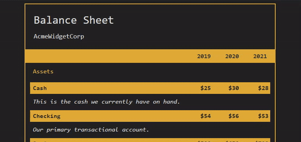

# Balance Sheet
A front-end balance sheet using pseudo selectors e.g. style of an element when you hover over it with your mouse, and trigger other events on the webpage.

This project is a demonstration website for the Financial Calculator and Document Builder (FCDD). It allows users to input Assets and Liabilities to calculate their Net Worth. 

## Future Features
- [ ] Add a way to view the balance sheet for multiple companies at once.
- [ ] Implement search functionality in company listings.
- [ ] Allow users to add new companies from within the app.
- [ ] Create an API endpoint that returns data about all companies, so it can be used by other apps/websites.
- [ ] Make the UI more responsive on mobile devices (currently not fully optimized).
- [ ] Display additional information about each financial item when selected. This could include things like notes
- [ ] Add unit tests and integration tests.

## Demo of Balance Sheet Site
